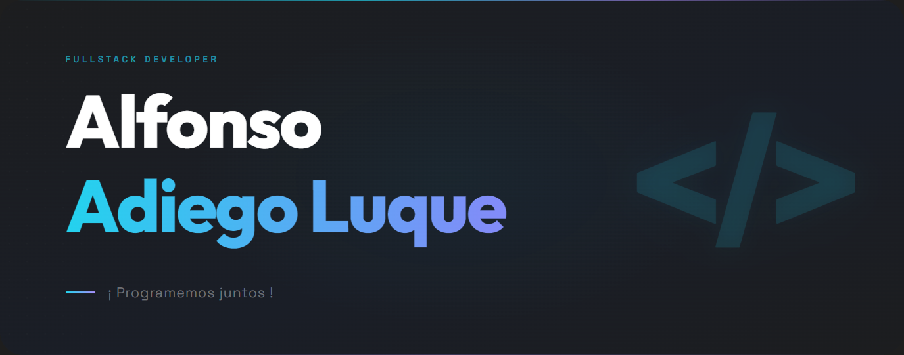

<h1 style="text-align: center; font-family: 'Fira Code', monospace; font-weight: 500; color: #00f2ff">Bienvenido, soy Alfonso Adiego Luque </h1>

Soy un estudiante de segundo año de **Desarrollo de Aplicaciones Web**. Me encanta **expandir** mi **conocimiento** sobre el mundo tecnológico, estando siempre abierto al **aprendizaje** de nuevas habilidades y tecnologías. 

Soy un apasionado de la **creación** de proyectos **innovadores**, y me esfuerzo por **aplicar** todos mis **conocimientos** en su creación, además de siempre estar dispuesto a **colaborar** con otros para **aprender** y **crecer** juntos. Mi objetivo es seguir desarrollando mis habilidades y **contribuir** a la creación de software, con proyectos **creativos**, **útiles** y **open source**.
<!--
**alfonsoadluq/alfonsoadluq** is a ✨ _special_ ✨ repository because its `README.md` (this file) appears on your GitHub profile.

Here are some ideas to get you started:

- 🔭 I’m currently working on ...
- 🌱 I’m currently learning ...
- 👯 I’m looking to collaborate on ...
- 🤔 I’m looking for help with ...
- 💬 Ask me about ...
- 📫 How to reach me: ...
- 😄 Pronouns: ...
- ⚡ Fun fact: ...
-->
