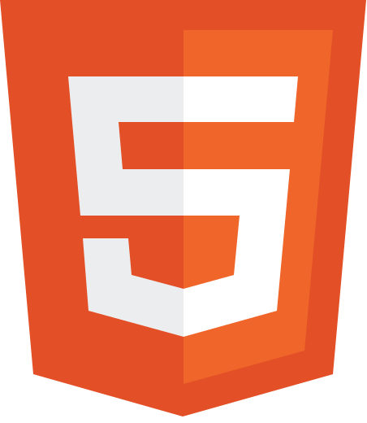
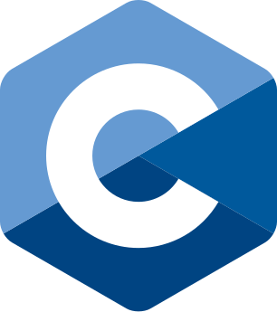
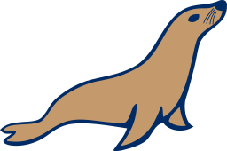
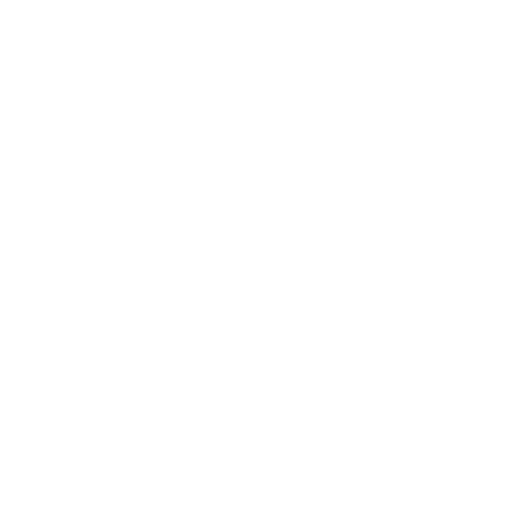
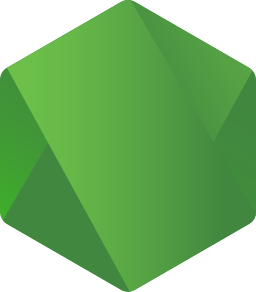
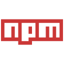
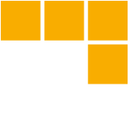
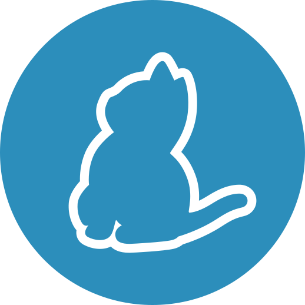
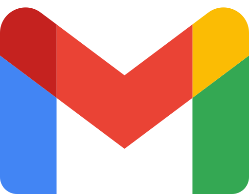

  

  

Soy un estudiante de segundo año de **Desarrollo de Aplicaciones Web**, formándome con mentalidad de **Ingeniero de Software** y con el **objetivo** claro de **consolidarme** en el sector a través del estudio de la **arquitectura** de software, la **calidad** de código y la **experiencia** técnica. 

Me encanta **expandir** mi **conocimiento** sobre el mundo tecnológico, estando siempre abierto al **aprendizaje** de nuevas habilidades y tecnologías. 

Soy un apasionado de la **creación** de proyectos **creativos** e **innovadores**, y me esfuerzo por **aplicar** todos mis **conocimientos** en su creación, además de siempre estar dispuesto a **colaborar** con otros para **aprender** y **crecer** juntos. 

Mi objetivo es seguir desarrollando mis habilidades y **contribuir** a la creación de software, con proyectos **creativos**, **útiles** y **open source**.

Puedes visitar mi **web personal** para conocer más sobre mí y mis proyectos: **[alfonsoaldev.com](https://alfonsoaldev.com)**

Si quieres **contactarme**, puedes hacerlo a través de una de estas vías: **[¡Contáctame!](#conéctate-conmigo)**

 

## ⭐️ **Últimos proyectos**

### ***KitKeeper*** (En desarrollo)
- 💻 Aplicación web construida en Laravel, enfocada en la **organización** y **control** del **material tecnológico** en el ámbito educativo.
- 📋 Dividida en **roles**: administrador, técnico, profesor y estudiante. Cuenta con un **sistema** de **gestión** de préstamos, devoluciones y reportes de incidencias, **divididos** en turnos de **mañana** y **tarde**.
- 🛠️ Implementación de **encriptado argon2id + Supabase** para seguridad, control de acceso mediante **roles aislados**, y técnicas de optimización avanzadas.
- 🚀 Arquitectura de base de datos  **PostgreSQL de hiper-escala**, diseñada para soportar **datos masivos** sin perder rendimiento. Incorpora *tuning* avanzado para hardware SSD/NVMe, **índices de alto rendimiento** (BRIN, GIN, parciales y *covering*) y estrategias de reducción de I/O (*HOT updates*, *fillfactor* dinámico).

 

## 📌 **Proyectos destacados**

 

## 🛠️ **Mi Stack Tecnológico**
<table>
  <tr>
    <td><strong>Lenguajes</strong></td>
    <td>
       &nbsp;
       &nbsp;
       &nbsp;
       &nbsp;
       &nbsp;
      
    </td>
  </tr>
  <tr>
    <td><strong>Frameworks</strong></td>
    <td>
       &nbsp;
       &nbsp;
       &nbsp;
       &nbsp;
      
    </td>
  </tr>
  <tr>
    <td><strong>Bases de Datos</strong></td>
    <td>
       &nbsp;
       &nbsp;
      
    </td>
  </tr>
  <tr>
    <td><strong>BaaS</strong></td>
    <td>
       &nbsp;
      
    </td>
  </tr>
  <tr>
    <td><strong>Cloud / Hosting</strong></td>
    <td>
       &nbsp;
      
    </td>
  </tr>
  <tr>
    <td><strong>Control de Versiones</strong></td>
    <td>
       &nbsp;
      
    </td>
  </tr>
  <tr>
    <td><strong>CMS</strong></td>
    <td>
      
    </td>
  </tr>
  <tr>
    <td><strong>Herramientas</strong></td>
    <td>
       &nbsp;
       &nbsp;
       &nbsp;
       &nbsp;
       &nbsp;
      
    </td>
  </tr>
</table>

 

## 📧 **Conéctate conmigo**

  
  &ensp;&ensp;
  
  &ensp;&ensp;
  

 

###
<!--

  
  
   

  

-->